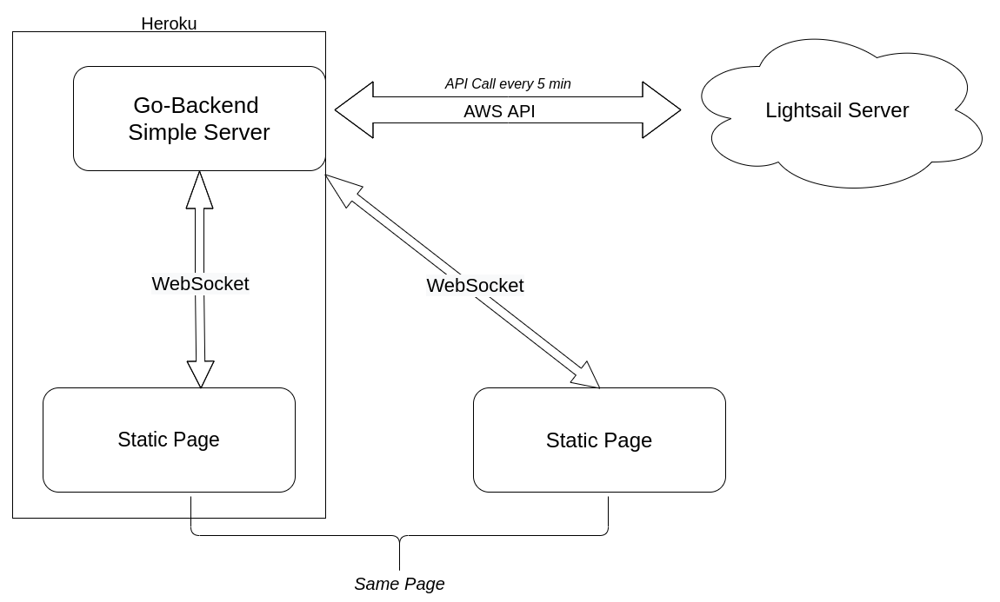

# SimpleServer

Monitor AWS Lightsail server by using AWS API and serve websocketed real-time updates.

<hr>

### !!!Caution. This project is custom made for specific case. Do not use for production.
<hr>

env:

```bash 
export AKID="AK***************VR"
export SECRET="xF************************************w0"
export REGION="ap-southeast-1"
export InstanceName="simple"
```


